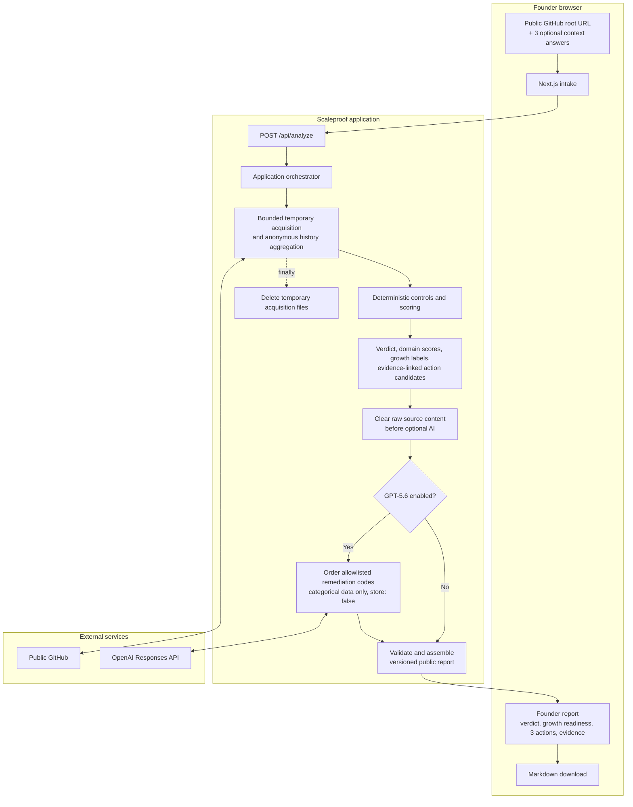

# Scaleproof

Find out whether a codebase can carry 10x more users and a real engineering
team.

Scaleproof analyzes one public GitHub repository and returns an evidence-based
`Fundable`, `Fixable`, or `Rewrite` verdict, no more than three immediate
actions, an expandable evidence dossier, and a Markdown report.

> Automated snapshot, not an audit.

This is the OpenAI Build Week edition. It has no private-repository access,
accounts, saved scans, analytics, lead capture, booking link, or sales call to
action.

## What it checks

Scaleproof evaluates seven repository-evidence domains:

1. architecture and team scalability;
2. quality and delivery;
3. security and privacy;
4. observability and operations;
5. reliability and user scalability;
6. data resilience and governance;
7. AI-agent readiness.

It also estimates recent repository and major-module contributor
concentration. Node.js/TypeScript and Java/Spring/Maven receive first-class
signals; other stacks receive generic repository, CI, dependency,
documentation, security, and operational checks.

Repository evidence is not proof of runtime behaviour, organizational
practice, measured capacity, compliance, or investment quality. Missing
evidence is kept separate from a concrete failure.

## Run locally

Prerequisites: Node.js 22.11 or newer, npm, and network access to public GitHub.

```bash
npm ci
npm run dev
```

Open `http://localhost:3000`.

No OpenAI key is required. Without one, deterministic policy orders the founder
actions. To enable GPT-5.6 ordering of allowlisted remediation codes:

```bash
export OPENAI_API_KEY="..."
npm run dev
```

An optional `GITHUB_TOKEN` raises GitHub API rate limits. It does not enable
private-repository access. Never store credentials in repository files; this
project intentionally has no environment-file template.

## Verify changes

```bash
npm run verify
```

The completion gate runs ESLint, TypeScript 6 and 7 compatibility checks,
Vitest, a production Next.js build, and Playwright founder-journey tests.
TypeScript 7 is the application CLI checker; the TypeScript 6 compatibility
package remains installed for Next.js and ESLint integrations that still need
the compiler API. Browser tests use the synthetic repository under
[`fixtures/scaleproof-demo`](./fixtures/scaleproof-demo) and cannot use ambient
OpenAI credentials.

## How it works



Source text, snippets, repository names, paths, secrets, personal data,
contributor identities, commit text, and raw history never enter the OpenAI
payload. GPT-5.6 receives categorical control data and remediation codes only;
the request uses structured output and `store: false`. Scores, verdicts,
severity, displayed action copy, evidence links, and completion conditions stay
deterministic.

Repository acquisition, extraction, scanning, history, model input, output, and
time are bounded. See the security and scoring authorities below for exact
behaviour.

## Documentation map

These are the active sources of truth:

| Document | Authority |
| --- | --- |
| [README.md](./README.md) | Product boundary, setup, and documentation map |
| [AGENTS.md](./AGENTS.md) | Agent workflow, non-negotiable rules, and recurring maintenance |
| [docs/ARCHITECTURE.md](./docs/ARCHITECTURE.md) | Modules, dependency direction, request lifecycle, and failure behaviour |
| [SCORING.md](./SCORING.md) | Versioned heuristic, evidence model, verdicts, and calibration policy |
| [SECURITY.md](./SECURITY.md) | Trust boundary, retention, and public-deployment gate |
| [TASKS.md](./TASKS.md) | Current implementation backlog and concise completion record |
| [BUILD_WEEK_SUBMISSION.md](./BUILD_WEEK_SUBMISSION.md) | Temporary submission and first-publishing checklist |
| [LICENSE](./LICENSE) | MIT terms |

Markdown inside `fixtures/scaleproof-demo` is synthetic scanner input, not
project guidance. Git history is the archive for superseded plans and completed
review detail.

## Codex and GPT-5.6

Codex was used for research, architecture, implementation, tests, browser QA,
and documentation. GPT-5.6 has one narrow runtime role: propose the ordering of
up to three allowlisted remediation codes. Invalid or unavailable model output
falls back to deterministic order.

The required Build Week evidence and primary Codex thread are recorded in
[BUILD_WEEK_SUBMISSION.md](./BUILD_WEEK_SUBMISSION.md).

## Deployment and license

The local MVP is the current goal. Public deployment is blocked until the
controls in [SECURITY.md](./SECURITY.md) are implemented and verified.

Scaleproof is available under the [MIT License](./LICENSE).
