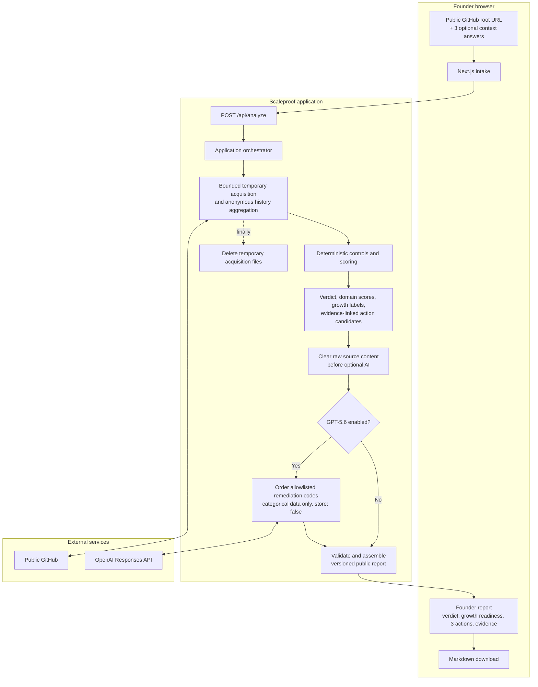

# Scaleproof

Find out whether a codebase can carry 10x more users and a real engineering
team.

Scaleproof analyzes one public GitHub repository and returns an evidence-based
`Fundable`, `Fixable`, or `Rewrite` verdict, no more than three immediate
actions, an expandable evidence dossier, and a Markdown report.

> Automated snapshot, not an audit.

This is the OpenAI Build Week edition. It has no private-repository access,
accounts, saved scans, analytics, lead capture, booking link, or sales call to
action.

## What it checks

Scaleproof evaluates seven repository-evidence domains:

1. architecture and team scalability;
2. quality and delivery;
3. security and privacy;
4. observability and operations;
5. reliability and user scalability;
6. data resilience and governance;
7. AI-agent readiness.

It also estimates recent repository and major-module contributor
concentration. Node.js/TypeScript and Java/Spring/Maven receive first-class
signals; other stacks receive generic repository, CI, dependency,
documentation, security, and operational checks.

Repository evidence is not proof of runtime behaviour, organizational
practice, measured capacity, compliance, or investment quality. Missing
evidence is kept separate from a concrete failure.

The evidence dossier also includes a versioned SaaS 10x audit lens: stateless
handling, database discipline, slow work, failure safety, configuration,
tenant isolation, observability, feature flags, CI, ownership, decisions,
dependency freshness limits, and critical-path tests. It is static and
read-only: it never runs the scanned repository or claims runtime capacity.

## Setup and run locally

Prerequisites: Node.js 22.11 or newer and npm. A network connection to public
GitHub is needed only when scanning a public repository.

```bash
npm ci
npm run dev
```

Open `http://localhost:3000`. For a fast, credential-free walkthrough, click
**Run the synthetic demo**. It exercises the complete report flow without
contacting GitHub or OpenAI.

No OpenAI key is required. Without one, deterministic policy orders the founder
actions. To enable GPT-5.6 ordering of allowlisted remediation codes:

```bash
export OPENAI_API_KEY="..."
npm run dev
```

An optional `GITHUB_TOKEN` raises GitHub API rate limits. It does not enable
private-repository access. Never store credentials in repository files; this
project intentionally has no environment-file template.

## Verify changes

```bash
npm run verify
```

The completion gate runs ESLint, TypeScript 6 and 7 compatibility checks,
Vitest, a production Next.js build, and Playwright founder-journey tests.
TypeScript 7 is the application CLI checker; the TypeScript 6 compatibility
package remains installed for Next.js and ESLint integrations that still need
the compiler API. Browser tests use the synthetic repository under
[`fixtures/scaleproof-demo`](./fixtures/scaleproof-demo) and cannot use ambient
OpenAI credentials.

## How Codex and GPT-5.6 were used

Codex and GPT-5.6 were used throughout the build: product research,
architecture, implementation, automated tests, browser QA, and project
administration such as creating and maintaining the README, license, and
submission materials.

The development workflow used separate implementer and reviewer Codex/GPT-5.6
sessions. Both worked from the same [`TASKS.md`](./TASKS.md) list: the
implementer delivered a scoped item, then the reviewer independently inspected
the result and recorded newly found issues for the next iteration. This pairing
was especially effective because the reviewer repeatedly surfaced defects and
edge cases that were not apparent during implementation.

At runtime, the repository scan and the AI evaluation are deliberately
separate. Scaleproof acquires and scans a public repository with bounded,
deterministic code: it calculates evidence, scores, verdicts, severity,
evidence links, and displayed action copy without sending repository content to
an AI model. Only after raw source material is cleared can GPT-5.6 receive a
small categorical, allowlisted summary and propose the ordering of up to three
remediation codes. Invalid, unavailable, or rejected model output falls back to
the deterministic order.

This separation keeps the factual result reproducible and makes the AI role
useful but constrained: GPT-5.6 helps prioritize the existing remediation
options; it does not inspect repository source or decide the assessment.

The required Build Week evidence and primary Codex thread are recorded in
[BUILD_WEEK_SUBMISSION.md](./BUILD_WEEK_SUBMISSION.md).

## How it works



Source text, snippets, repository names, paths, secrets, personal data,
contributor identities, commit text, and raw history never enter the OpenAI
payload. GPT-5.6 receives categorical control data and remediation codes only;
the request uses structured output and `store: false`. Scores, verdicts,
severity, displayed action copy, evidence links, and completion conditions stay
deterministic.

Repository acquisition, extraction, scanning, history, model input, output, and
time are bounded. See the security and scoring authorities below for exact
behaviour.

## Screenshots

Desktop-only captures from the synthetic demo repository. They contain no
customer or third-party repository data. Regenerate the complete set with:

```bash
npm run capture:media
```

The command starts a dedicated local server on `127.0.0.1:3199`, clears
`OPENAI_API_KEY`, runs the synthetic demo, validates all five images, then
replaces only the named files below. Each image is a 1500 x 1000 PNG (3:2). Set
`SCALEPROOF_CAPTURE_PORT` if that port is busy. Do not substitute a real
repository or add mobile captures to this public gallery.

| Screen | Media |
| --- | --- |
| Landing and GitHub URL intake | [Open PNG](./docs/media/scaleproof-landing.png) |
| Completed report, three immediate actions, and Markdown download | [Open PNG](./docs/media/scaleproof-report-overview.png) |
| Growth-readiness assessment | [Open PNG](./docs/media/scaleproof-growth-readiness.png) |
| Knowledge concentration and estimated bus factor | [Open PNG](./docs/media/scaleproof-knowledge-concentration.png) |
| Expanded evidence dossier | [Open PNG](./docs/media/scaleproof-evidence-dossier.png) |

## Canonical product documentation

These four documents own the current product behaviour. Keep durable facts in
their single applicable owner rather than repeating them elsewhere.

| Document | Authority |
| --- | --- |
| [README.md](./README.md) | Product boundary, setup, and documentation map |
| [docs/ARCHITECTURE.md](./docs/ARCHITECTURE.md) | Modules, dependency direction, request lifecycle, and failure behaviour |
| [SCORING.md](./SCORING.md) | Versioned heuristic, evidence model, verdicts, and calibration policy |
| [SECURITY.md](./SECURITY.md) | Trust boundary, retention, and public-deployment gate |

[AGENTS.md](./AGENTS.md) is the contributor operating guide;
[TASKS.md](./TASKS.md) is the open-work backlog;
[BUILD_WEEK_SUBMISSION.md](./BUILD_WEEK_SUBMISSION.md) is the Devpost
worksheet; and [LICENSE](./LICENSE) contains the MIT terms. None is a second
source of truth for current product behaviour.

Markdown inside `fixtures/scaleproof-demo` is synthetic scanner input, not
project guidance. Git history is the archive for superseded plans and completed
review detail.

## Deployment and license

The local MVP is the current goal. Public deployment is blocked until the
controls in [SECURITY.md](./SECURITY.md) are implemented and verified.

Scaleproof is available under the [MIT License](./LICENSE).
