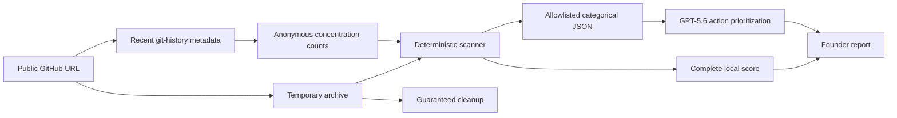

# Scaleproof

Find out whether a codebase can carry 10x more users and a real engineering
team.

Scaleproof analyzes a public GitHub repository, produces an evidence-based
`Fundable`, `Fixable`, or `Rewrite` verdict, and gives a busy founder no more
than three actions to take now. The detailed evidence remains available in a
separate expandable dossier and Markdown download.

> Automated snapshot, not an audit.

This repository is the hackathon edition. It has no accounts, saved history,
lead-generation form, booking link, or sales call to action.

## What it checks

- Architecture, module boundaries, onboarding, ownership, and parallel team work
- Tests, CI, quality gates, coverage, and dependency maintenance
- Authentication, authorization, secrets, validation, privacy, and security policy
- Application, access, security, and audit logs; redaction, retention, metrics, and alerts
- Statelessness, database foundations, failure controls, load tests, HA, and 10x/100x readiness
- Backups, restore evidence, RPO/RTO, rollback, GDPR-related data lifecycle, and breach response
- AI-agent instructions, executable verification harness, feedback-loop depth, and safety guardrails
- Repository-wide and major-module bus-factor concentration from recent git history
- Context-aware handling of compact initial Lovable exports

The scoring logic and verdict caps are documented in
[SCORING.md](./SCORING.md). The implementation architecture and invariants are
documented in [docs/ARCHITECTURE.md](./docs/ARCHITECTURE.md).
Contributor and agent workflows are documented in
[CONTRIBUTING.md](./CONTRIBUTING.md) and [AGENTS.md](./AGENTS.md).

## Local setup

Prerequisites:

- Node.js 22.11 or newer
- npm
- Network access to public GitHub repositories

Install and run:

```bash
npm ci
npm run dev
```

Open `http://localhost:3000`.

Scaleproof works without an OpenAI key. In that mode, the deterministic engine
selects and orders the three founder actions. To enable GPT-5.6 ordering of
allowlisted remediation codes, export the key in the current shell before
starting the app:

```bash
export OPENAI_API_KEY="..."
npm run dev
```

An optional `GITHUB_TOKEN` raises GitHub API rate limits. Only public
repositories are accepted even when this token is configured.

Do not put credentials in repository files. This project intentionally does not
include an environment-file template.

## Verification

```bash
npm run verify
```

This runs linting, TypeScript checks, all tests, and the production build. Pull
requests run the same gate in GitHub Actions.

The synthetic demo repository is under
[`fixtures/scaleproof-demo`](./fixtures/scaleproof-demo). It contains
deliberate, synthetic weaknesses so the report path is stable and does not
depend on a third-party repository.

## Privacy and data flow



Repository files are read only by the deterministic scanner. Source text,
snippets, repository names, file paths, secrets, personal data, and arbitrary
documentation text are never included in the OpenAI payload.

Recent git history is sampled separately for the repository and up to six major
module paths. Contributor identifiers are converted immediately into one-way
opaque keys. Names, emails, logins, commit messages, commit identifiers, module
paths, and raw history records are never included in the OpenAI payload or
retained in the report. Only aggregate contributor counts, concentration bands,
and the estimated bus factor are returned.

When explicit Lovable provenance is detected and the default-branch history is
still a compact initial export (at most 20 commits spanning at most seven days),
bus factor one remains visible but is not scored as an ownership failure. See
[SCORING.md](./SCORING.md) for the versioned criteria.

GPT-5.6 receives only:

- versioned control IDs;
- categorical outcomes and evidence tiers;
- severity and numeric weight;
- domain scores, overall score, and confidence;
- predefined remediation codes;
- aggregate pass counts and the three optional context answers.

The OpenAI request uses the
[Responses API](https://developers.openai.com/api/docs/guides/migrate-to-responses),
[Structured Outputs](https://developers.openai.com/api/docs/guides/structured-outputs),
and `store: false`. The last setting prevents application-state storage for
that request. It is not a Zero Data Retention claim; those are separate
organization-level controls described in OpenAI's
[data controls documentation](https://developers.openai.com/api/docs/guides/your-data#v1responses).

Temporary data handling:

- Download only from fixed GitHub API and codeload hosts after strict URL parsing.
- Store the archive in an operating-system temporary directory with owner-only permissions.
- Delete the directory in a `finally` block after success or failure.
- Do not log repository content, tokens, secrets, or personal data.
- Return `Cache-Control: no-store` on analysis responses.

See [SECURITY.md](./SECURITY.md) for the trust boundary and deployment
requirements.

## Limits

| Boundary | Limit | Result when crossed |
| --- | ---: | --- |
| Relevant text files | 5,000 | Partial scan |
| Extracted text | 50 MB | Partial scan |
| Compressed archive | 80 MB | Request rejected before extraction |
| Expanded archive | 200 MB or 25,000 entries | Extraction rejected and temporary data deleted |
| Acquisition and deterministic scan | 90 seconds | Partial report when scanning has started; otherwise a clear timeout response |
| Complete model input target | 12,000 tokens | Lower-priority findings aggregated or omitted |
| Complete model input hard cap | 16,000 tokens | Model request blocked |
| Model output | 2,000 tokens | Enforced by the API request |
| Git-history sample | 100 recent commits per scope; 6 major modules | Smaller or rate-limited samples are marked insufficient evidence |

Critical and high findings are retained first when the model-input target is
reached. The deterministic score always uses every scanned finding. The report
states how many actionable findings were available to the model.

Token size is conservatively estimated before the request. API-reported usage
is recorded after a successful response because local token estimates can
differ from server-side accounting.

## Codex and GPT-5.6

Codex was used to turn the product plan into the local application: research,
architecture, heuristic design, repository acquisition, privacy controls,
frontend implementation, tests, and browser QA.

GPT-5.6 has one narrow runtime responsibility: propose the order of up to three
allowlisted remediation codes. Titles, rationale, severity, evidence links,
and completion conditions remain deterministic. Invalid, duplicate, unknown,
or incomplete proposals fall back to deterministic risk order.

The Build Week evidence and primary Codex thread record are in
[BUILD_WEEK_SUBMISSION.md](./BUILD_WEEK_SUBMISSION.md).

## Deployment status

Deployment is deliberately deferred. The local MVP is the only current goal.
Codex Sites is the preferred next candidate after the hackathon build is stable,
but a production deployment also requires external rate limiting and operational
controls listed in [SECURITY.md](./SECURITY.md).

## License

Scaleproof is available under the [MIT License](./LICENSE). Third-party
dependencies and fonts remain subject to their respective licenses.
